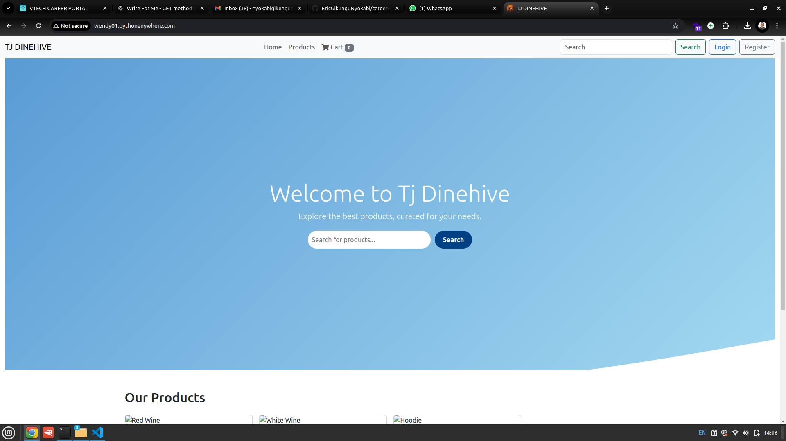

# TJ DINEHIVE 🍔🍕🥗  

Welcome to **TJ DINEHIVE**, an E-commerce food ordering platform that allows users to browse menus, place orders, and enjoy delicious meals from various restaurants. Built using modern web technologies, this platform ensures a seamless online food ordering experience.  

## **Screenshots & Features**  

### **1. Home Page (Landing Page)**
  
- A welcoming homepage showcasing featured meals and restaurant partners.  
- Easy navigation to browse categories, view popular dishes, and start ordering.  

---

## **How to Run TJ DINEHIVE Locally**  

### **1. Clone the Repository**  
```sh
git clone https://github.com/your-repository/tj-dinehive.git
cd tj-dinehive


# Link for creating thirdparty email app(password)
    https://myaccount.google.com/apppasswords 

# Upgrade pip
    pip install --upgrade pip

# Models
    pip install Flask-SQLAlchemy
    pip install flask migrate
    pip install flask-db

    Set the PYTHONPATH: When running Alembic commands, you need to ensure that the app module is in your Python path. You can do this by setting the PYTHONPATH environment variable. You can run the following command in your terminal:
    export PYTHONPATH=$(pwd)

# Flask Migrate commands
    flask db init  # Initializes the migrations directory (only needed once)
    flask db migrate -m "initial migration"  # Create a new migration
    flask db upgrade  # Apply the migration to the database
    pip show alembic
    flask db migrate -m "initial migration" --verbose
    rm -rf migrations/


# Flask Session
    pip install flask-session

    # session for app
    app.config["SESSION_PERMANENT"] = False
    app.config["SESSION_TYPE"] = "filesystem"  # Store session data on server
    Session(app)
    
# .env file
    pip install dotenv

